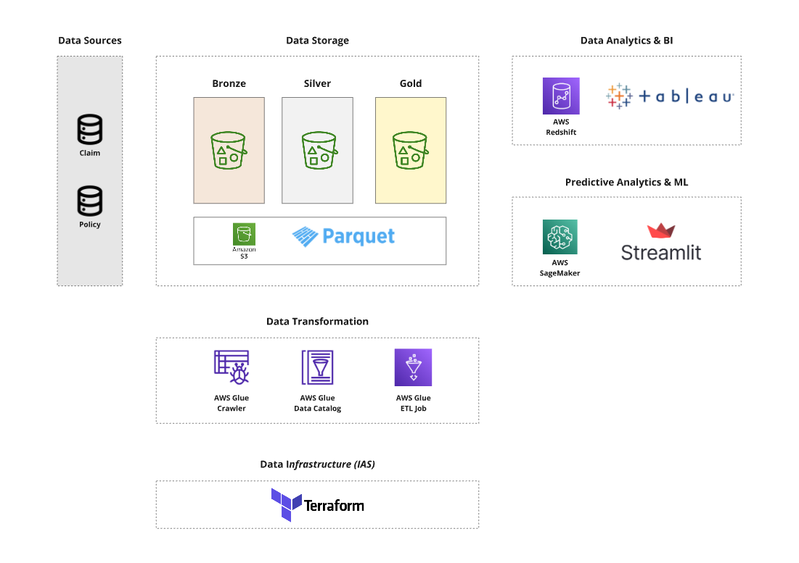
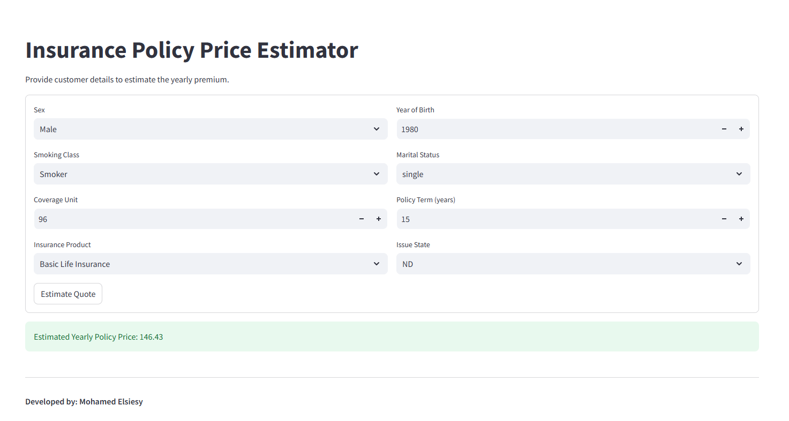

# Insurance Data Platform

## Project Overview

This project demonstrates the integration of data engineering, machine learning, and business intelligence tools to create a comprehensive insurance data platform. It showcases the effective use of AWS services to build scalable and secure data solutions, combined with user-friendly interfaces and advanced analytics capabilities. Leveraging a robust data lake architecture, this platform integrates various AWS services to facilitate efficient data storage, processing, and predictive analytics. Additionally, it incorporates a user-friendly interface for real-time premium estimation and advanced Business Intelligence (BI) capabilities using Tableau.

## Architecture

## Streamlit Application

Access the [Streamlit App](https://insurance-policy-price-estimator.streamlit.app/).

## Components

1. **Data Lake on Amazon S3**
   - **Purpose:** Centralized repository to store all insurance-related data in its raw format.
   - **Format:** Data is stored in Parquet format, which is optimized for performance and storage efficiency.
   - **Structure:** Organized into Bronze, Silver, and Golden layers to manage data quality and transformation stages.

2. **Data Ingestion and Processing with AWS Glue**
   - **AWS Glue Data Catalog:** Maintains a centralized metadata repository, enabling seamless data discovery and management.
   - **ETL Jobs:** Automated Extract, Transform, Load (ETL) processes to cleanse, transform, and prepare data for analytics and machine learning.
   - **Data Quality Checks:** Ensures the integrity and reliability of data through predefined quality rules, such as column count validation.

3. **Data Transformation and Masking**
   - **Sensitive Data Handling:** Utilizes AWS Glue transformations to detect and mask sensitive information (e.g., personal names, emails, SSNs) to comply with data privacy standards.
   - **Schema Mapping:** Applies consistent schema mappings across different datasets to maintain uniformity and facilitate downstream processing.

4. **Predictive Analytics with Amazon SageMaker**
   - **Model Training:**
     - **Pipeline:** A Scikit-learn pipeline that includes preprocessing steps (e.g., one-hot encoding, feature extraction) and a Linear Regression model to predict yearly insurance premiums.
     - **Data Split:** Splits data into training and testing sets to evaluate model performance using metrics like Mean Squared Error (MSE) and R².
   - **Model Deployment:**
     - **Pipeline Serialization:** The trained model pipeline is serialized and stored as `model.pkl` for deployment.
     - **Artifact Storage:** Model artifacts are uploaded to Amazon S3 for persistence and accessibility.

5. **Real-Time Prediction Interface with Streamlit**
   - **User Interface:** A Streamlit application that provides an interactive form for users to input customer details and receive estimated yearly premiums.
   - **Dynamic Form:** Utilizes predefined categorical mappings (e.g., sex, smoking class, product codes) to ensure accurate and consistent user inputs.
   - **Model Integration:** Loads the serialized SageMaker pipeline to perform real-time predictions based on user inputs.

6. **Business Intelligence and Visualization with Tableau**
   - **Data Visualization:** Connects to the processed data stored in Amazon S3 to create comprehensive dashboards and reports.
   - **Insights Generation:** Facilitates data-driven decision-making by visualizing key metrics, trends, and predictive analytics results.

## Data Flow

### Data Ingestion

Insurance data is ingested and stored in the Bronze layer of the Amazon S3 data lake in Parquet format.

### ETL Processing

AWS Glue jobs extract data from the Bronze layer, perform necessary transformations (including schema mapping and data masking), and load the cleansed data into the Silver layer. Data quality checks are enforced to maintain data integrity.

### Data Cataloging

The AWS Glue Data Catalog indexes the processed data, making it discoverable and queryable for downstream applications.

### Model Training

Amazon SageMaker accesses the cleansed data from the Silver layer to train a Linear Regression model using a Scikit-learn pipeline. The trained model pipeline is serialized and stored in the Golden layer of the S3 data lake.

### Real-Time Predictions

The Streamlit application retrieves the serialized model pipeline from S3. Users input customer details through the Streamlit UI, and the application provides real-time premium estimations using the deployed model.

### Business Intelligence

Tableau connects to the data in the Golden layer to generate interactive dashboards, offering insights into insurance trends, customer demographics, and model performance.

## Technologies Used

- **Data Storage & Lake:**
  - Amazon S3
  - Parquet

- **Data Processing & ETL:**
  - AWS Glue
  - AWS Glue Data Catalog
  - PySpark

- **Machine Learning & Analytics:**
  - Amazon SageMaker
  - Scikit-learn
  - Streamlit

- **Business Intelligence:**
  - Tableau

- **Infrastructure as Code:**
  - Terraform (for IAM, S3, and Glue module configurations)